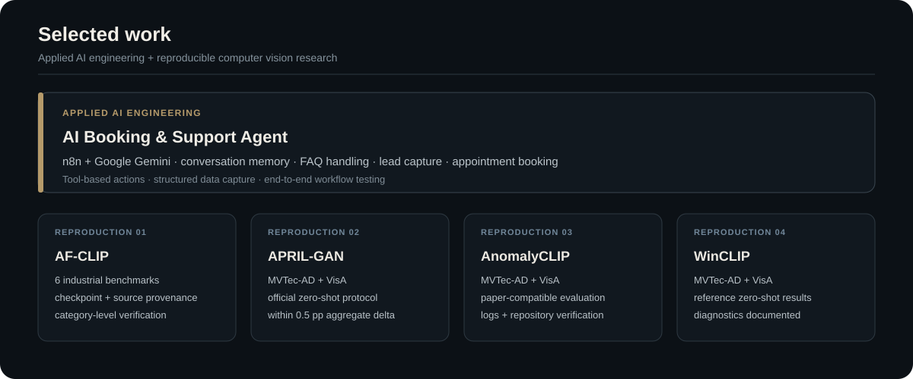

  

  <a href="https://www.linkedin.com/in/hammad-ali-haider/">LinkedIn</a> &nbsp;·&nbsp;
  <a href="mailto:hammadhaideerr@gmail.com">Email</a> &nbsp;·&nbsp;
  <a href="https://github.com/hammadhaideer">GitHub</a> &nbsp;·&nbsp;
  Ürümqi, China

## Profile

I am an **AI Engineer** and **M.S. candidate in Computer Science and Technology at Xinjiang University, China**. I work across applied AI engineering and research in computer vision, foundation models, and time-series learning.

My work includes reproducible model evaluation, visual anomaly-detection benchmarking, causal and online time-series evaluation, NLP model fine-tuning, and AI-agent workflows. I care about implementations that can be inspected, measured, and reproduced.

  

## Selected work

  

**Engineering:** [AI Booking & Support Agent](https://github.com/hammadhaideer/ai-booking-agent)  
**Research reproductions:** [AF-CLIP](https://github.com/hammadhaideer/af-clip-reproduced) · [APRIL-GAN](https://github.com/hammadhaideer/april-gan-reproduced) · [AnomalyCLIP](https://github.com/hammadhaideer/anomalyclip-reproduced) · [WinCLIP](https://github.com/hammadhaideer/winclip-reproduced)

The research repositories contain independent reproduction and evaluation work. Original methods, code, checkpoints, and datasets remain attributed to their respective authors and licenses.

## Technical stack

  

## Research output

  

- **Graduate Researcher, Xinjiang University** — computer vision and time-series anomaly detection.
- **First-author manuscript under anonymous review at AAAI 2027.** Paper-specific details are intentionally omitted during review.
- **First-author work for IEEE ICASSP 2027** on causal time-series anomaly detection, co-authored with Panpan Zheng.

**Research interests:** efficient and adaptive foundation models, parameter-efficient fine-tuning, robust and test-time adaptation, model compression, efficient attention, and low-resource multilingual NLP.

## Connect

I am open to **remote AI Engineer roles, applied-AI internships, and research internships** where strong implementation and careful research matter together.

  <a href="https://www.linkedin.com/in/hammad-ali-haider/"><strong>LinkedIn</strong></a>
  &nbsp;&nbsp;·&nbsp;&nbsp;
  <a href="mailto:hammadhaideerr@gmail.com"><strong>hammadhaideerr@gmail.com</strong></a>

