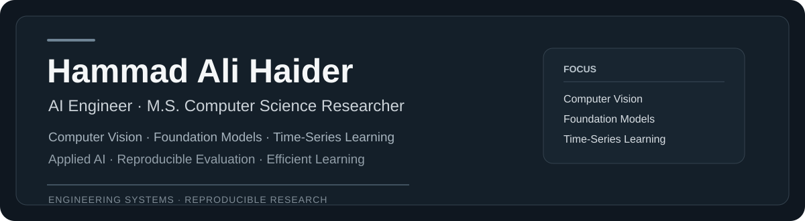
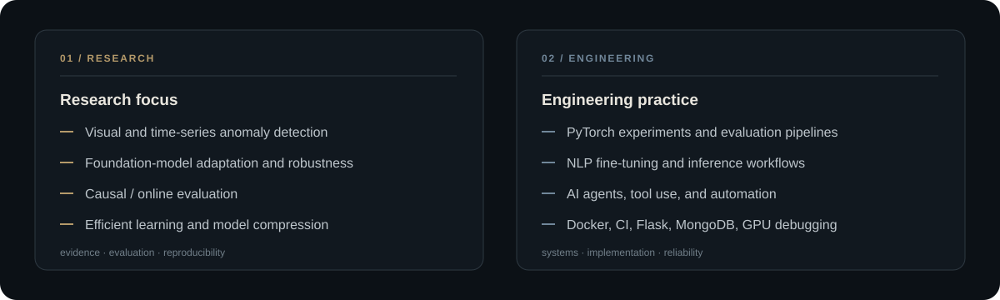
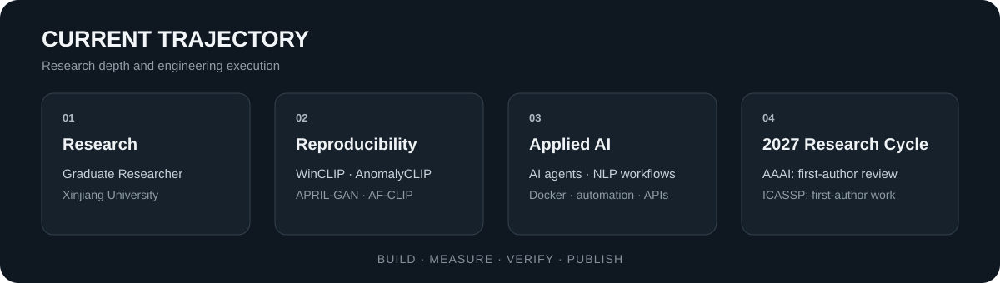

  

  <a href="https://www.linkedin.com/in/hammad-ali-haider/">LinkedIn</a> &nbsp;•&nbsp;
  <a href="mailto:hammadhaideerr@gmail.com">Email</a> &nbsp;•&nbsp;
  <a href="https://github.com/hammadhaideer">GitHub</a> &nbsp;•&nbsp;
  Ürümqi, China

## Profile

I am an **AI Engineer** and **M.S. candidate in Computer Science and Technology at Xinjiang University, China**. My work sits between applied AI engineering and research in computer vision, foundation models, and time-series learning.

I build reproducible evaluation pipelines, reproduce and benchmark published methods, debug model and GPU environments, fine-tune NLP models, and develop applied AI systems. I prefer work that can be measured, inspected, and reproduced.

  

## Technical toolkit

  

## Selected engineering

### [AI Booking & Support Agent](https://github.com/hammadhaideer/ai-booking-agent)
An AI receptionist workflow built with **n8n** and **Google Gemini**. It answers business FAQs, keeps short-term conversation context, captures leads, and books appointments through tool-based actions and structured data capture.

**Shows:** AI agents · tool use · workflow automation · conversation memory · structured data extraction · end-to-end testing

## Research & reproducibility

<table>
<tr>
<td width="50%" valign="top">

### [AF-CLIP Reproduced](https://github.com/hammadhaideer/af-clip-reproduced)
Zero-shot evaluation across six industrial anomaly-detection benchmarks, with source provenance, checkpoint verification, deterministic compatibility fixes, and category-level results.

</td>
<td width="50%" valign="top">

### [APRIL-GAN Reproduced](https://github.com/hammadhaideer/april-gan-reproduced)
Official zero-shot evaluation on MVTec-AD and VisA. The aggregate results are reproduced within 0.5 percentage points of the paper.

</td>
</tr>
<tr>
<td width="50%" valign="top">

### [AnomalyCLIP Reproduced](https://github.com/hammadhaideer/anomalyclip-reproduced)
Paper-compatible zero-shot evaluation on MVTec-AD and VisA with sanitized logs, aggregate summaries, source provenance, and repository verification.

</td>
<td width="50%" valign="top">

### [WinCLIP Reproduced](https://github.com/hammadhaideer/winclip-reproduced)
Reference zero-shot results on MVTec-AD and VisA, with diagnostic implementation differences documented separately for transparency.

</td>
</tr>
</table>

> These repositories contain independent reproduction and evaluation work. Original methods, code, checkpoints, and datasets remain attributed to their respective authors and licenses.

## Research output

  

- **Graduate Researcher, Xinjiang University** — computer vision and time-series anomaly detection.
- **First-author manuscript under anonymous review at AAAI 2027.** Paper-specific details are intentionally omitted during review.
- **First-author work for IEEE ICASSP 2027** on causal time-series anomaly detection, co-authored with Panpan Zheng.

My broader research interests include efficient and adaptive foundation models, parameter-efficient fine-tuning, robust and test-time adaptation, model compression, efficient attention, and low-resource multilingual NLP.

## What I care about

**Research:** reproducibility, careful baselines, evaluation design, causal/online settings, and methods that remain useful under realistic constraints.

**Engineering:** dependable AI workflows, readable implementations, clean experiment structure, reproducible environments, and systems that do more than produce a demo screenshot.

## Connect

I am interested in **remote AI Engineer roles, applied-AI internships, and research internships** where I can contribute to both implementation and research.

  <strong><a href="https://www.linkedin.com/in/hammad-ali-haider/">LinkedIn</a></strong>
  &nbsp;&nbsp;•&nbsp;&nbsp;
  <strong><a href="mailto:hammadhaideerr@gmail.com">hammadhaideerr@gmail.com</a></strong>

  AI engineering · computer vision · foundation models · time-series learning · reproducible research

